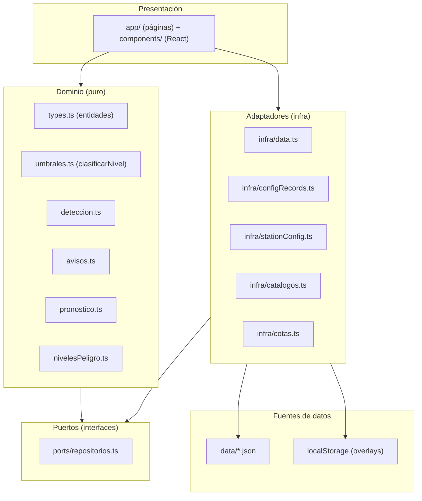
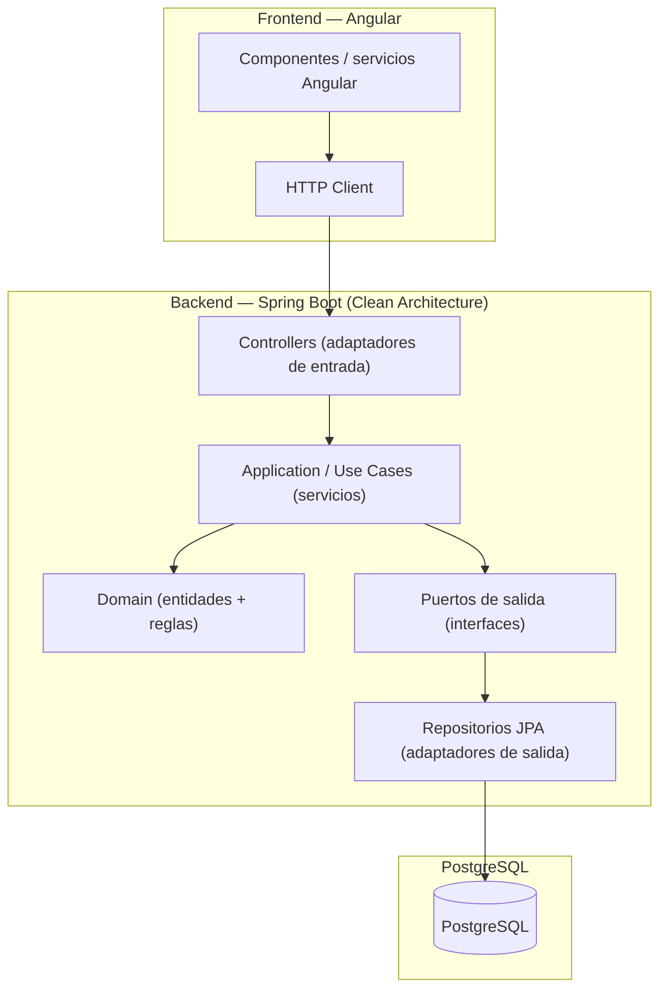

# 01 — Arquitectura

## 1. Stack actual (PoC)

| Capa | Tecnología |
| --- | --- |
| Framework | Next.js 16 (App Router) |
| UI | React 19 + TypeScript |
| Estilos | Tailwind CSS v4 |
| Gráficos | Recharts 3 |
| Mapas | Leaflet 1.9 + react-leaflet 5 |
| Export | html-to-image (PNG/JPG) |
| Gestor de paquetes | pnpm |

Persistencia del PoC: JSON estático en `data/` + overlays en `localStorage`.

## 2. Estructura de carpetas

```
app/                  → páginas (rutas) y layouts
  monitoreo/          → módulo Monitoreo
  pronostico/         → módulo Pronóstico (público)
  avisos/             → módulo Avisos (listado y detalle [id])
  admin/              → panel de contingencia
    config/           → configuración (umbrales + ficha de estación)
    avisos/           → detección y publicación de avisos
    pronostico/       → registro/edición de pronóstico
    centros-poblados/ → catálogo de centros poblados
components/           → componentes React reutilizables
lib/
  domain/             → lógica de negocio pura (sin I/O)
  ports/              → contratos de repositorio (interfaces)
  infra/              → adaptadores (JSON + localStorage)
  ui/                 → helpers de UI (mapIcons, tabs)
data/                 → JSON estáticos (fuente de verdad base)
docs/                 → esta documentación
```

## 3. Capas (Clean Architecture)



**Regla de dependencia**: el dominio **no** depende de `infra` ni de React. `infra` implementa los `ports`. La UI consume `domain` e `infra`.

- `domain/`: funciones puras (`detectarAvisos`, `prepararAviso`, `crearAviso`, `buildForecastDiario`, `clasificarNivel`). No tocan `localStorage` ni JSON.
- `ports/repositorios.ts`: contratos (`StationRepository`, `ObservacionRepository`, `AvisoRepository`, `PronosticoRepository`, `ConfigRepository`).
- `infra/`: implementaciones concretas que leen JSON + overlay.

## 4. Arquitectura objetivo (producción)



### Correspondencia de capas

| PoC (Next.js) | Producción (Spring Boot + Angular) |
| --- | --- |
| `lib/domain/*` | Entidades + servicios de dominio (`domain`) |
| `lib/ports/repositorios.ts` | Interfaces de repositorio (puertos de salida) |
| `lib/infra/*` (JSON/localStorage) | Repositorios JPA + controladores REST |
| `components/` + `app/` | Componentes y servicios Angular |
| Overlays de `localStorage` | Persistencia transaccional en PostgreSQL |
| `getMockNow()` / JSON | Reloj de datos real / lectura desde BD |

> El detalle capa por capa está en [06-mapeo-poc-produccion.md](./06-mapeo-poc-produccion.md).
