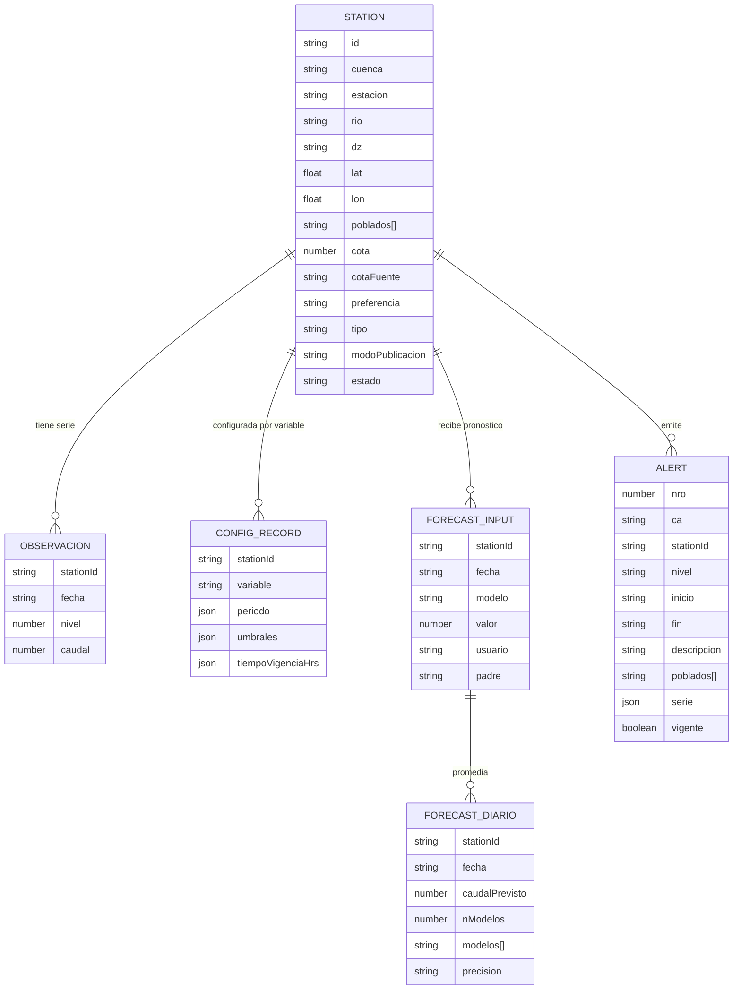
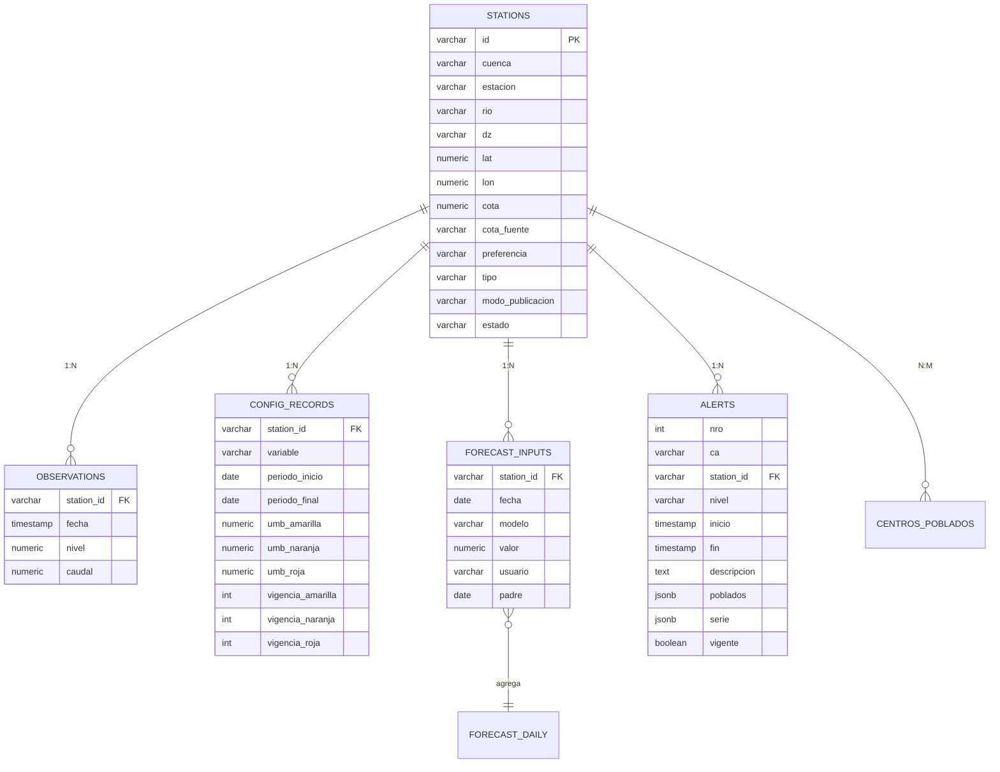

# 02 — Modelo de datos

## 1. Entidades de dominio (`lib/domain/types.ts`)

### Tipos principales

| Tipo | Descripción |
| --- | --- |
| `Station` | Ficha de estación: preferencia (caudal/nivel), tipo (avenida/vigilancia), cota, variables, estado, modo de publicación, poblados. |
| `Observation` | Lectura fusionada (nivel + caudal) por fecha. |
| `Lectura` | Serie por variable (`nivel.json` / `caudal.json`). |
| `ConfigRecord` | Tabla de configuración: umbrales + vigencia por (estación, variable, periodo). `periodo.final === null` = vigente. |
| `ForecastInput` | Entrada de un modelo de pronóstico. `padre` = primer día del grupo de 3. |
| `ForecastDiario` | Pronóstico diario = promedio de los modelos de una (estación, fecha). |
| `Alert` | Aviso publicado (documento congelado con `serie`, `umbrales`, `poblados`). |

## 2. Fuentes de datos (PoC)

### JSON estáticos (`data/`)

| Archivo | Contenido |
| --- | --- |
| `stations.json` | Estaciones base (sin cota). |
| `nivel.json`, `caudal.json` | Series horarias por variable (una variable por archivo). |
| `cotas.json` | Catálogo de cotas (cero de la regla) por estación. |
| `config_records.json` | Tabla de umbrales/vigencia base. |
| `forecast_inputs.json` | Entradas de pronóstico base. |
| `alerts.json` | Avisos base (ya traen `serie`). |

### Overlays (`localStorage`)

| Clave | Edita | Implementación |
| --- | --- | --- |
| `senamhi_station_config` | Ficha de estación | `infra/stationConfig.ts` |
| `senamhi_config_records` | Tabla de configuración | `infra/configRecords.ts` |
| `senamhi_forecast_inputs` | Entradas de pronóstico | `infra/catalogos.ts` |
| `senamhi_avisos` | Avisos publicados | `infra/data.ts` |

**Regla de merge**: se lee el JSON base y el overlay; el overlay gana por clave (ej. `stationId|variable`, `stationId|fecha|modelo`).

## 3. Mapeo a PostgreSQL (producción)

### Notas de migración

- `Observation`/`Lectura` → tabla `observations` (serie horaria, una fila por `station_id + fecha`).
- `ConfigRecord.periodo` → columnas `periodo_inicio` / `periodo_final` (NULL = vigente). La regla `getConfigVigente` (inicio más reciente que cubre la fecha) se implementa con una consulta.
- `ForecastDiario` puede **derivarse** (vista/consulta de `forecast_inputs`) o materializarse en `forecast_daily`.
- `Alert.serie` / `Alert.umbrales` → columnas `jsonb` (snapshot congelado) o tablas hijas.
- Los overlays de `localStorage` desaparecen: todo pasa a transacciones sobre PostgreSQL.
