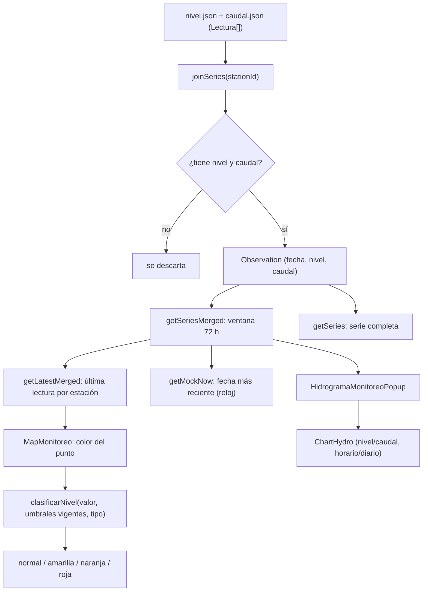
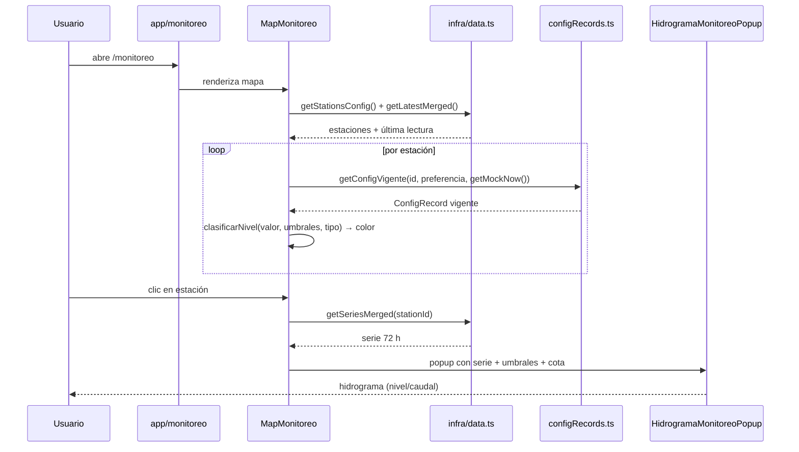

# 03 — Flujo del módulo Monitoreo

Muestra niveles y/o caudales observados de la red, con el estado derivado al leer.

## 1. Diagrama de flujo

## 2. Diagrama de secuencia

## 3. Reglas de negocio

1. **Estado derivado**: el color del punto y el nivel se calculan **al leer**, comparando la última lectura contra `clasificarNivel`.
2. **Preferencia**: `Station.preferencia` (`caudal` | `nivel`) decide qué variable se compara.
3. **Tipo**: `avenida` (mayor es peor) vs `vigilancia` (menor es peor).
4. **Cota**: solo se usa para el eje en m.s.n.m.; la clasificación usa el valor relativo.
5. **Mantenimiento**: estaciones en `estado === "mantenimiento"` se pintan gris.

## 4. Puntos de entrada / componentes

| Archivo | Rol |
| --- | --- |
| `app/monitoreo/page.tsx` | Página (client) con banner + tabs. |
| `components/MapMonitoreoClient.tsx` | Dynamic import (ssr: false). |
| `components/MapMonitoreo.tsx` | Mapa Leaflet + colores + popup. |
| `components/HidrogramaMonitoreoPopup.tsx` | Tarjeta del hidrograma (radio Nivel/Caudal, Horario/Diario). |
| `components/ChartHydro.tsx` | Gráfico Recharts (con leyenda y Brush). |
| `lib/infra/data.ts` | `joinSeries`, `getSeriesMerged`, `getLatestMerged`, `getMockNow`. |

## 5. Producción

- `nivel.json` / `caudal.json` → tabla `observations` (ingesta de productos horarios ya limpios).
- `getLatestMerged` / `getMockNow` → consultas SQL (última lectura / fecha máxima).
- El estado se sigue derivando en el **dominio** (servicio Spring), no se almacena.
