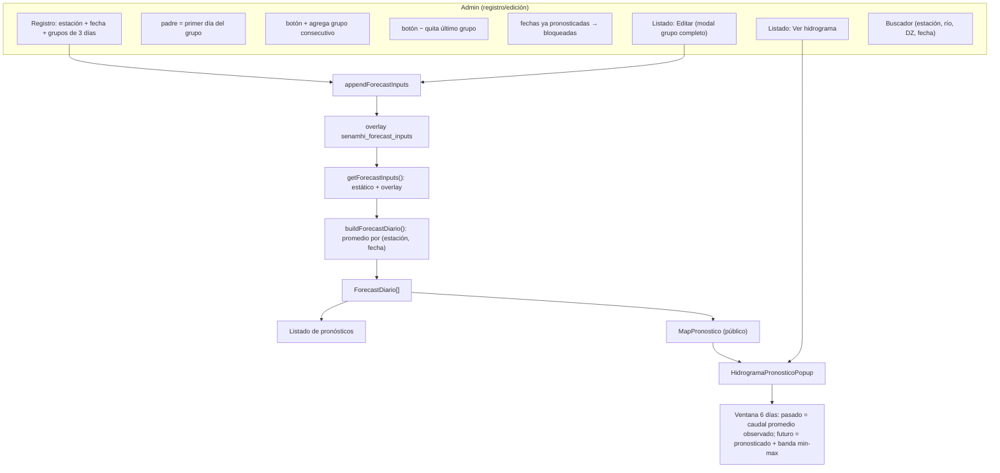
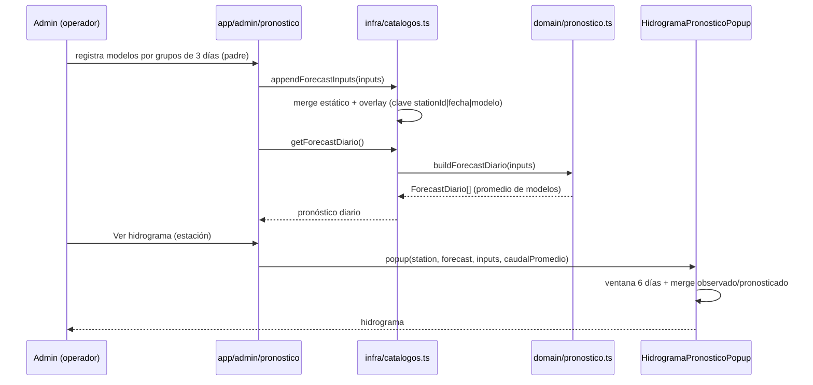

# 04 — Flujo del módulo Pronóstico

Pronóstico hidrológico diario (promedio de modelos), en grupos de 3 días.

## 1. Diagrama de flujo

## 2. Diagrama de secuencia

## 3. Reglas de negocio

1. **Grupos de 3 días**: el `padre` es el **primer día** del grupo (`padre, padre+1, padre+2`).
2. **`buildForecastDiario`**: 0 modelos → se omite; 1 → ese valor; 2+ → promedio aritmético.
3. **Persistencia**: el último pronóstico se mantiene (overlay). Si no hay nuevo, se muestra el último.
4. **Ventana del hidrograma**: mínimo 6 días terminando en el último día pronosticado.
   - Días **sin** pronóstico → "Caudal Promedio" (promedio diario observado de `caudal.json`).
   - Días **con** pronóstico → "Caudal Pronosticado" + banda min-max (rango de los modelos).
   - Con 6+ días pronosticados, solo se muestran los pronosticados.
5. **Bloqueo en registro**: las fechas ya pronosticadas no se editan en el formulario; se editan desde el listado (modal del grupo completo).

## 4. Puntos de entrada / componentes

| Archivo | Rol |
| --- | --- |
| `app/pronostico/page.tsx` | Página pública (client) + armado de props. |
| `components/MapPronostico.tsx` / `MapPronosticoClient.tsx` | Mapa + popup. |
| `components/HidrogramaPronosticoPopup.tsx` | Hidrograma (ventana 6 días + banda). |
| `app/admin/pronostico/page.tsx` | Registro (grupos +/−), listado (buscar/editar/ver). |
| `lib/domain/pronostico.ts` | `buildForecastDiario` (promedio de modelos). |
| `lib/infra/catalogos.ts` | `getForecastInputs`, `appendForecastInputs`, `getForecastDiario`. |
| `lib/infra/data.ts` | `getCaudalPromedioDiario` (promedio diario observado). |

## 5. Producción

- `forecast_inputs` → tabla `forecast_inputs` (POST por modelo o por lote).
- `buildForecastDiario` → consulta de agregación (`AVG(valor) GROUP BY station_id, fecha`).
- El promedio diario observado (`getCaudalPromedioDiario`) → agregación sobre `observations`.
- La ventana de 6 días y el merge observado/pronosticado se mantienen en el **dominio** (servicio Spring).
