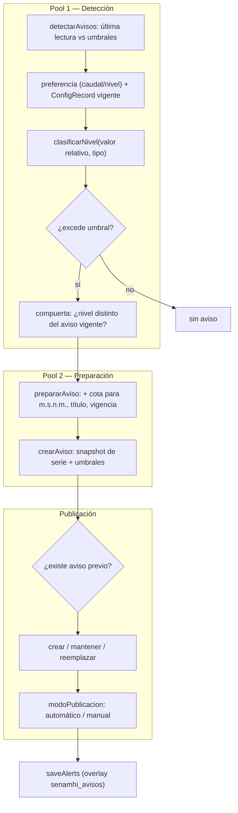
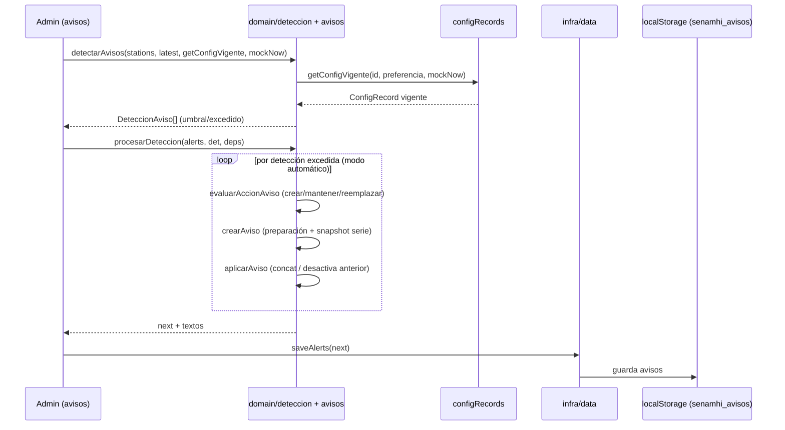

# 05 — Flujo del módulo Avisos

Avisos hidrológicos preventivos. El flujo replica dos "pools" del proceso Bizagi.

## 1. Diagrama de flujo (BPMN simplificado)

## 2. Diagrama de secuencia

## 3. Reglas de negocio

1. **Pool 1 (detección)** compara el valor **relativo** contra umbrales **relativos** (sin cota). Usa `Station.preferencia` y `getConfigVigente`.
2. **`clasificarNivel`**: avenida = mayor es peor; vigilancia = menor es peor.
3. **Compuertas** (`evaluarAccionAviso`):
   - sin aviso previo → `crear`.
   - con previo y mismo nivel → `mantener` (no hace nada).
   - con previo y distinto nivel → `reemplazar` (desactiva el anterior + crea).
4. **Pool 2 (preparación)**: si es nivel y hay cota, `nivel absoluto = nivel relativo + cota` (solo visualización). La vigencia sale de `ConfigRecord.tiempoVigenciaHrs`.
5. **Publicación**: `procesarDeteccion` solo auto-publica estaciones en `modoPublicacion === "automatico"`. El admin permite publicar manualmente.
6. **Aviso congelado**: `Alert.serie` guarda el snapshot de la serie al emitir; el detalle usa `aviso.serie ?? getSeriesMerged(...)`.

## 4. Puntos de entrada / componentes

| Archivo | Rol |
| --- | --- |
| `lib/domain/deteccion.ts` | `detectarAvisos` (Pool 1). |
| `lib/domain/umbrales.ts` | `clasificarNivel`. |
| `lib/domain/avisos.ts` | `evaluarAccionAviso`, `prepararAviso`, `crearAviso`, `aplicarAviso`, `procesarDeteccion`. |
| `lib/domain/nivelesPeligro.ts` | Peligro/recomendación por nivel y tipo. |
| `app/admin/avisos/page.tsx` | Detección, publicación manual/automática, toggle vigencia, restore. |
| `app/avisos/page.tsx` | Listado público de avisos. |
| `app/avisos/[id]/page.tsx` | Detalle del aviso (con hidrograma congelado). |

## 5. Producción

- La detección (`detectarAvisos`) y las compuertas son **dominio puro** → servicios Spring.
- La auto-publicación se dispara por un job (scheduler) o al ingerir nuevas observaciones.
- `saveAlerts` → transacción que inserta/actualiza la tabla `alerts` (y desactiva el aviso previo en "reemplazar").
- `Alert.serie` → snapshot `jsonb` o referencia a la serie persistida.
